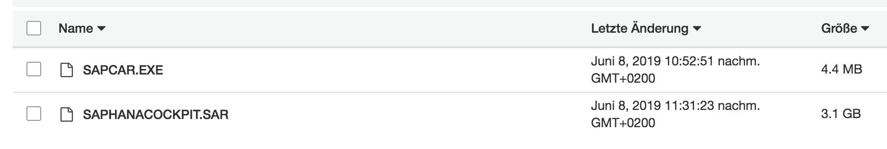

# Overview

Automatically install SAP HANA Cockpit on SLES OS, according to
https://help.sap.com/viewer/df02d156db744412ad1f9e887aba68ad/2.10.0.0/en-US/b4729151dec84b048627bdd004ae5f62.html

## Prerequisites:

- SLES OS
- S3 bucket with downloaded software (via SAP Support Launchpad), as seen below:



## Deployment

### Manually:

```bash
$ chmod 700 deploy.sh
$ ./deploy.sh s3://<bucket>/ <password>
```

e.g.

```bash
$ chmod 700 deploy.sh
$ ./deploy.sh s3://sap-sources/HANA_CLIENT/HANA_COCKPIT/ MyHanaCP123#
```


### Via AWS Systems Manager (SSM):

1) Choose 'AWS-RunRemoteScript'
2) Choose Source Type "GitHub"
3) Choose Command Line "deploy.sh s3://<bucket>/ <password>"

```json
{
"owner":"frumania",
"repository":"aws-sap-scripts",
"path":"hana_cockpit"
}
```

## Post-Deployment steps

- Create HANA Role
```sql
CREATE USER <username> PASSWORD <password> NO FORCE_FIRST_PASSWORD_CHANGE;
GRANT CATALOG READ to <username>;
GRANT SELECT on SCHEMA _SYS_STATISTICS to <username>;
```
- Launch HANA Cockpit: https://<hostname>:3<instance number>32

## Todo

- Create Role
- Dynamic software version/filename