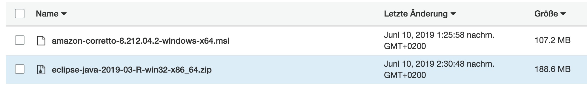

# Overview

Automatically installs Eclipse on Windows

## Prerequisites:

- Win OS 64bit
- S3 bucket with software:



## Deployment

### Manually:

```cmd
$ powershell.exe -File "deploy.ps1" "<bucket>" "<prefix>"
```

e.g.

```cmd
$ powershell.exe -File "deploy.ps1" "sap-sources" "HANA_CLIENT/HANA_STUDIO"
```


### Via AWS Systems Manager (SSM):

1) Choose 'AWS-RunRemoteScript'
2) Choose Source Type "GitHub"
3) Choose Command Line 'powershell.exe -File "deploy.ps1" "<bucket>" "<prefix>"'

```json
{
"owner":"frumania",
"repository":"aws-sap-scripts",
"path":"hana_studio"
}
```

## Todo

Auto install SAP plugins for Eclipse