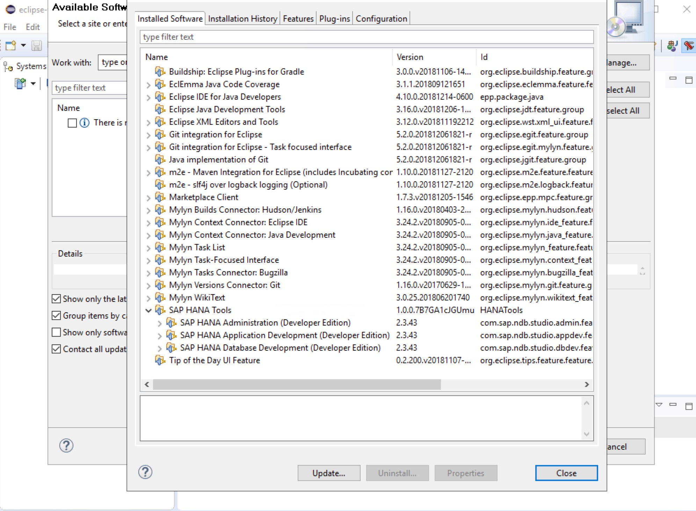

# Overview

Automatically installs Amazon Corretto JDK (8.212.04.2) and Eclipse (2018-12) incl. latest SAP HANA Studio Plugins.

## Prerequisites:

- Win OS 64bit

## Deployment

### Manually:

```cmd
$ powershell.exe -File "deploy.ps1"
```

e.g.

```cmd
$ powershell.exe -File "deploy.ps1"
```


### Via AWS Systems Manager (SSM):

1) Choose: AWS-RunRemoteScript
2) Source Type: GitHub
3) Source Info:
```json
{
"owner":"frumania",
"repository":"aws-sap-scripts",
"path":"hana_studio"
}
```
4) Command Line: powershell.exe -File "deploy.ps1"

## Result



## Todo

n/a